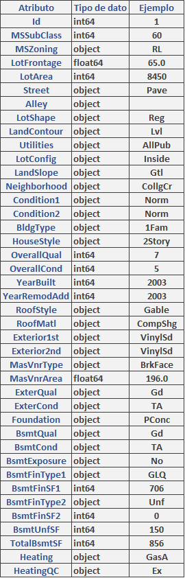
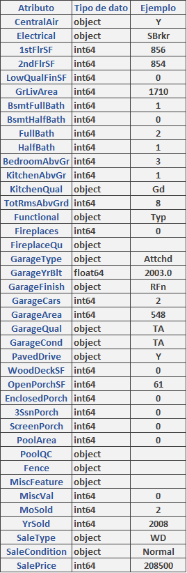

```{r setup, include=FALSE}
knitr::opts_chunk$set(echo = TRUE)
if (!require('reticulate')) install.packages('reticulate', dependencies = TRUE); library('reticulate')
```
# Descripción del dataset
Este dataset se denomina “Ames Housing” y mediante 79 variables, describe todos los aspectos que influyen en la valoración de compra/venta de viviendas residenciales en Ames ( Iowa, EEUU). Mediante estas variables podemos determinar el precio futuro de una vivienda.

El dataset ha sido elaborado por Dean De Cock con el objetivo de educar en ciencia de datos, siendo una alternativa al famoso dataset “Boston Housing”. Por ello, consideramos este dataset una excelente elección para la elaboración de esta práctica.

El dataset se compone de 4 ficheros, de los cuales, únicamente emplearemos train.csv

* Train.csv: destinado a crear el modelo
* Test.csv: destinado a testear el modelo
* Data description: descripción de cada atributo.
* Sample_submision.csv: ejemplo de referencia de una regresión lineal por año y mes de venta, superficie y número de dormitorios.

## Atributos

* MSSubClass: identifica el tipo de vivienda involucrada en la venta.
* MSZoning: identifica la clasificación general de zona
* LoteFrontage: pies lineales de calle conectados a la propiedad.
* LotArea: Tamaño del lote en pies cuadrados.
* Street: Tipo de vía de acceso a la propiedad
* Alley: Tipo de callejón de acceso a la propiedad.
* LotShape: forma general de la propiedad.
* LandContour: Planitud de la propiedad.
* Utilities: tipo de instalaciónes disponibles.
* LotConfig: configuración del lote.
* LandSlope: Pendiente de la propiedad.
* Neighborhood: ubicaciones físicas dentro de los límites de la ciudad de Ames.
* Condition 1: proximidad a varias condiciones.
* Condition 2: Proximidad a varias condiciones (si más de una está presente).
* BldgType: Tipo de vivienda.
* HouseStyle: estilo de vivienda.
* OverallQual: Califica el material general y el acabado de la casa.
* OverallCond: Califica el estado general de la casa.
* YearBuilt: fecha de construcción original.
* RoofStyle: Tipo de techo.
* RoofMatl: material del techo.
* Exterior1st: Revestimiento exterior de la casa.
* Exterior2nd: Revestimiento exterior de la casa (si hay más de un material).
* MasVnrType: tipo de chapa de mampostería.
* MasVnrArea: Área de revestimiento de mampostería en pies cuadrados.
* ExterQual: Evalúa la calidad del material en el exterior.
* ExterCond: Evalúa el estado actual del material en el exterior.
* Foundation: Tipo de fundación.
* BsmtQual: Evalúa la altura del sótano.
* BsmtCond: Evalúa el estado general del sótano.
* BsmtExposure: se refiere a muros a nivel de jardín o de huelga.
* BsmtFinType1: Calificación del área terminada del sótano.
* BsmtFinSF1: pies cuadrados terminados tipo 1
* BsmtFinType2: Calificación del área terminada del sótano (si hay varios tipos).
* BsmtFinSF2: pies cuadrados terminados tipo 2.
* BsmtUnfSF: pies cuadrados sin terminar de área del sótano
* TotalBsmtSF: Total de pies cuadrados de área del sótano.
* Heating: Tipo de calefacción.
* HeatingQC: calidad y estado de la calefacción.
* CentralAir: aire acondicionado central.
* Electrical: sistema eléctrico.
* 1stFlrSF: pies cuadrados del primer piso.
* 2ndFlrSF: pies cuadrados del segundo piso.
* LowQualFinSF: pies cuadrados con acabado de baja calidad (todos los pisos).
* GrLivArea: pies cuadrados de área habitable sobre el nivel (suelo).
* BsmtFullBath: Baños completos en el sótano.
* BsmtHalfBath: Medios baños del sótano.
* FullBath: baños completos sobre rasante.
* HalfBath: Medios baños sobre el nivel del suelo.
* Bedroom: dormitorios sobre el nivel del suelo (NO incluye dormitorios en el sótano).
* Kitchen: Cocinas sobre rasante.
* KitchenQual: calidad de la cocina.
* TotRmsAbvGrd: Total de habitaciones sobre rasante (no incluye baños).
* Functional: funcionalidad del hogar (suponga que es típico a menos que se justifiquen las deducciones).
* Fireplaces: Número de chimeneas.
* FireplaceQu: Calidad de chimenea.
* GarageType: Ubicación del garaje.
* GarageYrBlt: año en que se construyó el garaje.
* GarageFinish: Acabado interior del garaje.
* GarageCars: Tamaño del garaje en capacidad de automóvil.
* GarageArea: Tamaño del garaje en pies cuadrados.
* GarageQual: Calidad de garaje.
* GarageCond: Estado del garaje.
* PavedDrive: entrada pavimentada.
* WoodDeckSF: Área de la plataforma de madera en pies cuadrados.
* OpenPorchSF: Área de porche abierto en pies cuadrados.
* EnclosedPorch: área de porche cerrado en pies cuadrados.
* 3SsnPorch: área de porche de tres estaciones en pies cuadrados.
* ScreenPorch: Área del porche de la pantalla en pies cuadrados.
* PoolArea: Área de la piscina en pies cuadrados.
* PoolQC: Calidad de la piscina.
* Fence: calidad de la valla.
* MiscFeature: característica miscelánea no cubierta en otras categorías.
* MiscVal: $ Valor de la característica miscelánea.
* MoSold: Mes vendido (MM).
* YrSold: año vendido (YYYY).
* SaleType: Tipo de venta.
* SaleCondition: Condición de venta.
* SalePrice. Precio de venta

## Objetivo
Para establecer los objetivos del análisis, extrapolamos el ejercicio a un entorno del mundo, tomando la hipótesis de que el interés del análisis es el de una inmobiliaria. Con ello, dado el gran volumen de atributos, realizaremos una selección previa de los mismos, seleccionando los 12 atributos más relevantes para el estudio

En primer objetivo es realizar un estudio descriptivo para obtener un resumen de las características de la muestra y obtener una visión general de los datos necesarios previos antes de realizar la limpieza de los datos. También pretendemos dar una visión general de la consistencia del dataset, visualizando valores extremos, nulos, incongruentes o mal formateados.

Tras ello, se construirá un modelo de regresión múltiple que permita determinar el precio de la vivienda, a partir de los atributos seleccionados.

Finalmente, nos planteamos las siguientes preguntas a responder:

* ¿Cuál es el precio de la propiedad en función de las variables OverallQual, OverallCond, LotArea, Yearbuilt?
* ¿Se puede asumir que las casas del barrio CollgCr tienen un mayor lote de área que las de BrkSide?
* ¿La varianza del precio de venta es diferente de 70442^2?
* ¿Cuál es el grado de correlación de OverallQual, OverallCond, LotArea, Yearbuilt respecto a SalePrice?
* Dados los valores lotArea = 8650, overallCond = 6, overallQual = 5, yearBuilt = 2004, cuál es el valor de venta de la propiedad?

# Integración y selección de los datos a analizar
En este punto se describen los primeros pasos que se deben realizar antes de la limpieza de los datos y su posterior análisis, es decir, la lectura y visionado previo del dataset. Se han seguido los siguientes pasos:

Se cargan las librerías

```{python}
import pandas.util.testing as tm
import pandas as pd
import matplotlib.pyplot as plt
import numpy as np
import seaborn as sns
from sklearn.pipeline import Pipeline
from sklearn.preprocessing import StandardScaler,PolynomialFeatures
from sklearn.linear_model import LinearRegression
```

## Carga del dataset
Para ello, se ha empleado la función read_csv() de la librería pandas, para obtener un dataframe con el que trabajaremos en toda la práctica.

```{python}
file_name='/run/media/vv/DatosVv/Sync/Docs/U/UOC/2/TipologiaCicloVidaDatos/PRA2/M2.851_20211_PRA2_NotSync/dataset/train.csv'
df=pd.read_csv(file_name)
```
Para hacernos una idea de los datos que componen el dataset, se ha empleado la función head(), para visualizar las cabeceras.

```{python}
pd.set_option('display.max_columns', None)
headers = df.head()
headers
```

Posteriormente, para guardar esta información en un CSV (comprimido ) y elaborar el Anexo 1.A, se ha empleado el siguiente código:

```{python}
compression_opts = dict(method='zip',
                        archive_name='out.csv')
df_headers = pd.DataFrame(headers)

df_headers.to_csv('python/headers.zip', index=False,
          compression=compression_opts)
```

## Tipología de los datos
El siguiente paso es ver el tipo de datos que tiene el dataset, esta información es de gran utilidad para el análisis. Esta información la obtenemos mediante dtypes(). Dado el gran número de atributos, en el Anexo 1.A, se pueden ver todos los atributos, a continuación se muestran solo algunos.

Para elaborar el Anexo 1.A se ha guardado esta información en un CSV

```{python}
types = df.dtypes
types

df_types = pd.DataFrame(types)
df_types.to_csv(index=True)
df_types.to_csv('python/types.zip', index=True,
          compression=compression_opts)
```

## Selección de los datos

Una vez que tenemos una imagen general del dataset y como se ha mencionado en el punto anterior, se va a realizar una preselección de los atributos más relevantes para la elaboración de la práctica. Estos atributos son:

* LotArea
* Neighborhood
* OverallQual
* OverallCond
* YearBuilt
* TotRmsAbvGrd
* SaleCondition
* SalePrice

# Limpieza de los datos
Una vez que tenemos los atributos que nos interesan, eliminados del dataset el resto.


```{python}
if 'MSSubClass' in  df:
    df = df.drop(["MSSubClass"],axis=1)

if 'MSZoning' in  df:
    df = df.drop(["MSZoning"],axis=1)

if 'LotFrontage' in  df:
    df = df.drop(["LotFrontage"],axis=1)

if 'Street' in  df:
    df = df.drop(["Street"],axis=1)

if 'Alley' in  df:
    df = df.drop(["Alley"],axis=1)

if 'LotShape' in  df:
    df = df.drop(["LotShape"],axis=1)

if 'LandContour' in  df:
    df = df.drop(["LandContour"],axis=1)

if 'Utilities' in  df:
    df = df.drop(["Utilities"],axis=1)


if 'LotConfig' in  df:
    df = df.drop(["LotConfig"],axis=1)

if 'LandSlope' in  df:
    df = df.drop(["LandSlope"],axis=1)

if 'Condition1' in  df:
    df = df.drop(["Condition1"],axis=1)

if 'Condition2' in  df:
    df = df.drop(["Condition2"],axis=1)

if 'BldgType' in  df:
    df = df.drop(["BldgType"],axis=1)

if 'HouseStyle' in  df:
    df = df.drop(["HouseStyle"],axis=1)

if 'RoofStyle' in  df:
    df = df.drop(["RoofStyle"],axis=1)

if 'RoofMatl' in  df:
    df = df.drop(["RoofMatl"],axis=1)

if 'YearRemodAdd' in  df:
    df = df.drop(["YearRemodAdd"],axis=1)

if 'Exterior1st' in  df:
    df = df.drop(["Exterior1st"],axis=1)

if 'Exterior2nd' in  df:
    df = df.drop(["Exterior2nd"],axis=1)

if 'MasVnrType' in  df:
    df = df.drop(["MasVnrType"],axis=1)

if 'MasVnrArea' in  df:
    df = df.drop(["MasVnrArea"],axis=1)

if 'ExterQual' in  df:
    df = df.drop(["ExterQual"],axis=1)

if 'ExterCond' in  df:
    df = df.drop(["ExterCond"],axis=1)

if 'Foundation' in  df:
    df = df.drop(["Foundation"],axis=1)

if 'BsmtQual' in  df:
    df = df.drop(["BsmtQual"],axis=1)


if 'BsmtCond' in  df:
    df = df.drop(["BsmtCond"],axis=1)

if 'BsmtExposure' in  df:
    df = df.drop(["BsmtExposure"],axis=1)

if 'BsmtFinType1' in  df:
    df = df.drop(["BsmtFinType1"],axis=1)

if 'BsmtFinSF1' in  df:
    df = df.drop(["BsmtFinSF1"],axis=1)

if 'BsmtFinType2' in  df:
    df = df.drop(["BsmtFinType2"],axis=1)

if 'BsmtFinSF2' in  df:
    df = df.drop(["BsmtFinSF2"],axis=1)

if 'BsmtUnfSF' in  df:
    df = df.drop(["BsmtUnfSF"],axis=1)

if 'TotalBsmtSF' in  df:
    df = df.drop(["TotalBsmtSF"],axis=1)

if 'HeatingQC' in  df:
    df = df.drop(["HeatingQC"],axis=1)

if 'CentralAir' in  df:
    df = df.drop(["CentralAir"],axis=1)

if 'Electrical' in  df:
    df = df.drop(["Electrical"],axis=1)

if '1stFlrSF' in  df:
    df = df.drop(["1stFlrSF"],axis=1)

if '2ndFlrSF' in  df:
    df = df.drop(["2ndFlrSF"],axis=1)

if 'LowQualFinSF' in  df:
    df = df.drop(["LowQualFinSF"],axis=1)

if 'GrLivArea' in  df:
    df = df.drop(["GrLivArea"],axis=1)

if 'BsmtFullBath' in  df:
    df = df.drop(["BsmtFullBath"],axis=1)

if 'BsmtHalfBath' in  df:
    df = df.drop(["BsmtHalfBath"],axis=1)

if 'HalfBath' in  df:
    df = df.drop(["HalfBath"],axis=1)

if 'KitchenQual' in  df:
    df = df.drop(["KitchenQual"],axis=1)

if 'Functional' in  df:
    df = df.drop(["Functional"],axis=1)

if 'Fireplaces' in  df:
    df = df.drop(["Fireplaces"],axis=1)

if 'FireplaceQu' in  df:
    df = df.drop(["FireplaceQu"],axis=1)

if 'GarageType' in  df:
    df = df.drop(["GarageType"],axis=1)

if 'GarageYrBlt' in  df:
    df = df.drop(["GarageYrBlt"],axis=1)

if 'GarageFinish' in  df:
    df = df.drop(["GarageFinish"],axis=1)

if 'GarageArea' in  df:
    df = df.drop(["GarageArea"],axis=1)

if 'GarageCond' in  df:
    df = df.drop(["GarageCond"],axis=1)

if 'GarageQual' in  df:
    df = df.drop(["GarageQual"],axis=1)

if 'PavedDrive' in  df:
    df = df.drop(["PavedDrive"],axis=1)

if 'WoodDeckSF' in  df:
    df = df.drop(["WoodDeckSF"],axis=1)

if 'OpenPorchSF' in  df:
    df = df.drop(["OpenPorchSF"],axis=1)

if 'EnclosedPorch' in  df:
    df = df.drop(["EnclosedPorch"],axis=1)

if '3SsnPorch' in  df:
    df = df.drop(["3SsnPorch"],axis=1)

if 'ScreenPorch' in  df:
    df = df.drop(["ScreenPorch"],axis=1)

if 'PoolArea' in  df:
    df = df.drop(["PoolArea"],axis=1)

if 'PoolQC' in  df:
    df = df.drop(["PoolQC"],axis=1)

if 'Fence' in  df:
    df = df.drop(["Fence"],axis=1)

if 'MiscFeature' in  df:
    df = df.drop(["MiscFeature"],axis=1)

if 'MiscVal' in  df:
    df = df.drop(["MiscVal"],axis=1)

if 'MoSold' in  df:
    df = df.drop(["MoSold"],axis=1)

if 'YrSold' in  df:
    df = df.drop(["YrSold"],axis=1)

if 'SaleType' in  df:
    df = df.drop(["SaleType"],axis=1)


df.shape
```

Finalmente, empleamos el método describe para obtener un resumen estadístico de los atributos que vamos a emplear

```{python}
df.describe()
```

Identificamos si tenemos valores nulos

```{python}
missing_data = df.isnull()
missing_data.head(5)
```

Después empleamos un “loop for” para determinar el número de valores que faltan para cada atributo; True significa que el valor falta y False que el valor está.

```{python}
for column in missing_data.columns.values.tolist():
    print(column)
    print (missing_data[column].value_counts())
    print("")
```

Lo anterior podemos verlo visualmente de la siguiente manera; comprobando que no hay ningún valor nulo:

```{python}
#sns.heatmap(df.isna(), cbar=False)("")

#((df.shape[0]-df.isna().sum())/df.shape[0])*100
```

### Valores extremos
Los valores extremos son aquellos que se encuentran alejados de la distribución normal de la variable. Para identificarlos hemos optado por representar los datos en diagramas de caja.

En la siguiente imagen podemos ver todas las variables representadas, donde ya se puede apreciar a simple vista los atributos que son numéricos y tienen valores extremos; LotArea y SalesPrice.

```{python}
features = ['LotArea','Neighborhood','OverallQual','OverallCond','YearBuilt','Heating','FullBath',
            'BedroomAbvGr','KitchenAbvGr','TotRmsAbvGrd','GarageCars','SaleCondition','SalePrice']
df[features].boxplot(return_type='axes');

sns.boxplot(df.LotArea, width= 0.2, orient="v").set(title='Diagrama de Cajas LotArea')
sns.boxplot(df.SalePrice, width= 0.2, orient="v").set(title='Diagrama de Cajas SalePrice')
```

LotArea indica en 〖ft〗^2 el área del lote en venta. En este caso, los valores extremos que vemos por encima de 150000 y 200000, son perfectamente coherentes, ya que nada nos hace pensar que no existan lotes con un gran terreno.

SalePrice indica el precio del lote, de la misma manera que en el caso anterior, nada nos puede hacer pensar que los valores extremos por encima de 500000, 600000 y 700000, son incongruentes, ya que es perfectamente racional, pensar que existan lotes con estos precios.

# Análisis de datos
## Carga del archivo procesado

```{r message= FALSE, warning=FALSE}
# Se establece una semilla para hacer repetible el proceso
set.seed(123)
setwd("/")

# Carga del archivo
# Se carga el juego de datos, nótese "strip.white" = TRUE para eliminar los espacios en blanco al inicio y final.
df_train <- read.csv('/run/media/vv/DatosVv/Sync/Docs/U/UOC/2/TipologiaCicloVidaDatos/PRA2/M2.851_20211_PRA2_NotSync/dataset/train_summarized.csv', stringsAsFactors = FALSE, strip.white = TRUE, sep = ",")
```
## Selección de los grupos de datos que se quieren analizar/comparar (planificación de los análisis a aplicar).
La siguiente tabla resume los test a aplicar y su respectivo grupo de datos

| Test | Conjunto de variables | Propósito/Preguntas |
| -- | -- | -- |
| Contraste de hipótesis | Neighborhood, LotArea, SalePrice | 1. Se puede asumir que las casas del barrio CollgCr tienen un mayor lote de área que las de BrkSide? 2. La varianza del precio de venta es diferente de 70442^2? |
| Correlación de variables | LotArea, OverallCond, OverallQual, YearBuilt, SalePrice, SalesCondition | Evaluación de la asociación de las variables mediante Pearson/Chi cuadrado |
| Regresión lineal múltiple | OverallQual, OverallCond, LotArea, Yearbuilt | Predicción del precio de una vivienda en función de un grupo de variables |

## Comprobación de la normalidad y homogeneidad de la varianza

```{r message= FALSE, warning=FALSE}
## Por inspección visual se examina la normalidad de las variables contempladas
if (!require('ggplot2')) install.packages('ggplot2', dependencies = TRUE); library('ggplot2')
qqnorm(df_train$LotArea, pch = 1); qqline(df_train$LotArea, lwd = 3)
qqnorm(df_train$SalePrice, pch = 1); qqline(df_train$SalePrice, lwd = 3)
qqnorm(df_train$TotRmsAbvGrd, pch = 1); qqline(df_train$TotRmsAbvGrd, lwd = 3)
qqnorm(df_train$OverallCond, pch = 1); qqline(df_train$OverallCond, lwd = 3)
qqnorm(df_train$OverallQual, pch = 1); qqline(df_train$OverallQual, lwd = 3)

## Se aplica test estadístico para verificar la normalidad de las variables contempladas
if (!require('nortest')) install.packages('nortest', dependencies = TRUE); library('nortest')
lillie.test(df_train$LotArea)
lillie.test(df_train$SalePrice)
lillie.test(df_train$TotRmsAbvGrd)
lillie.test(df_train$OverallCond)
lillie.test(df_train$OverallQual)
```

El p value es inferior a 0.05, por lo que se puede afirmar que todas las variables consideradas siguen una distribución normal

```{r message= FALSE, warning=FALSE}
# Ahora se comprueba homocedasticidad de la varianza para los grupos de datos que se analizarán bajo contraste de hipótesis
## Se generan los dos grupos para el contrase de hipótesis 1 (posteriormente se indicarán las ecuaciones de la hipótesis respectiva)
df_train_Neighborhood_CollgCr <- subset(df_train, df_train$Neighborhood == "CollgCr")
df_train_Neighborhood_BrkSide <- subset(df_train, df_train$Neighborhood == "BrkSide")

## Una vez verificado la distribución normal de los datos de aplica el f-test para comprobar su homocedasticidad
var.test(df_train_Neighborhood_CollgCr$LotArea, df_train_Neighborhood_BrkSide$LotArea)
```

El p value es superior a 0.05, se concluye que la diferencia de las varianzas no es significativa. Se cumple el criterio de homocedasticidad

## Aplicación de pruebas estadísticas para comparar los grupos de datos. En función de los datos y el objetivo del estudio, aplicar pruebas de contraste de hipótesis, correlaciones, regresiones, etc. Aplicar al menos tres métodos de análisis diferentes.

### Contraste de hipótesis
#### ¿Se puede asumir que las casas del barrio CollgCr tienen un mayor lote de área que las de BrkSide?

Las hipótesis son:

* H0: U1 - U2 = 0
* H1: U1 - U2 > 0

Se aplicará contraste de dos muestras independientes con varianzas desconocidas:

* La hipótesis establece dos muestras: Barrio CollgCr y Barrio BrkSide
* Las muestras son independientes dado que no existe una relación explícita entre ellas
* No se conoce la varianza de las poblaciones. En el pasó anterior se aplicó el test de igualdad de varianzas y se concluyó que la diferencia de varianzas no es significativa
* Unilateral a la derecha
* Ambas muestras superan las 30 observaciones

```{r message= FALSE, warning=FALSE}
### Se ejecuta el contraste unilateral por la derecha ("greater"), con varianzas iguales (var.equal = T) y se verifica
result <- t.test(df_train_Neighborhood_CollgCr$LotArea, df_train_Neighborhood_BrkSide$LotArea, alternative = "g", var.equal = T)
result; result$p.value
```

* El valor medio de LotArea de la población se encuentra en los rangos 1632.138 e infinito con un 95% de certeza
* Con un p value inferior a 0.05 se concluye que las casas del barrio CollgCr tienen una mayor área de lote que las casas del barrio BrkSide (H1)

#### ¿La varianza del precio de venta es diferente de 70442^2??
Las hipótesis son:

* H0: σ2 = 50000
* H1: σ2 != 50000

Se aplicará contraste sobre la varianza:

* Bilateral
* La variable SalePrice sigue una distribución normal (comprobada en pasos anteriores)
* Ambas muestras superan las 30 observaciones

```{r message= FALSE, warning=FALSE}
### Se ejecuta el test de igualdad de varianzas con sigma elevado a 2
if (!require('EnvStats')) install.packages('EnvStats', dependencies = TRUE); library('EnvStats')
varTest(df_train$SalePrice, alternative = "two.sided", sigma.squared = 4962075364, conf.level = 0.95, data.name = NULL)
```

* La varianza para el atributo SalePrice se encuentra en los rangos 5877056096 y 6795343509 con un 95% de confianza
* Con un p-value menor a 0 se concluye que la varianza del precio de venta es diferente a 70442^2

### Correlación de variables

```{r message= FALSE, warning=FALSE}
### Se aplicará Pearson para variables lineales y numéricas. Posteriormente se usará chi-cuadrado para las variables categóricas
### Dada la poca normalidad de los datos se convertirán a escala logarítmica con el propósito de mejorar la inspección visual. Se seleccionan solamente las variables numéricas de ínteres
if (!require('dplyr')) install.packages('dplyr', dependencies = TRUE); library('dplyr')
df_train.log <- log(select(df_train, c(LotArea, OverallCond, OverallQual, YearBuilt, SalePrice)))
### Se generan los gráficos de dispersión por cada variable de ínteres.
if (!require('dplyr')) install.packages('dplyr', dependencies = TRUE); library('dplyr')
pairs(df_train.log)
### Se calcula el grado de correlación lineal de las variables de ínteres con Pearson, dado que los datos siguen una distribución normal y cumplen con el criterio de homocedasticidad
cor(df_train.log, method = "pearson")
### Se visualiza gráficamente las relaciones entre las variables
if (!require('corrplot')) install.packages('corrplot', dependencies = TRUE); library('corrplot')
corrplot(cor(df_train.log, method = "pearson"), method = "number", type = "upper", order = "hclust", tl.col = "black", tl.srt = 45)
```

| Variable | Grado de correlación con el precio de venta | Interpretación |
| -- | -- | -- | -- |
| LotArea | 0.3999 | Grado de correlacion bajo, no parece existir una relación importante entre estas dos variables |
| OverralCond | 0.0008 | Grado de correlacion muy bajo, no parece existir una relación importante entre estas dos variables |
| OverrallQual | 0.79 | Grado de correlacion alto, parece existir una relación importante entre el precio de venta y la condición general (influencia positiva) |
| Yearbuilt | 0.5844 | Grado de correlación medio, parece existir una relación entre el precio de venta y el año de construcción (influencia positiva |

```{r message= FALSE, warning=FALSE}
### Se aplica chi-cuadrado para las variables categóricas
### Se discretiza el precio de venta y condición general usando k-means (3 grupos)
if (!require('arules')) install.packages('arules', dependencies = TRUE); library('arules')

df_train$SalePrice_cat <- discretize(df_train$SalePrice, method = "cluster",
                                     breaks = 3,
                                     labels = c("LowPrice", "MidPrice", "HighPrice"))
df_train$OverallCond_cat <- discretize(df_train$OverallCond, method = "cluster",
                                       breaks = 3,
                                       labels = c("BadConditions", "AcceptableConditions", "VeryGoodConditions"))

contigency_OverallCond_catVsSalePrice_cat <- table(df_train$SalePrice_cat, df_train$OverallCond_cat); contigency_OverallCond_catVsSalePrice_cat

chisq <- chisq.test(contigency_OverallCond_catVsSalePrice_cat); chisq
round(chisq$p.value)
```

Con un p-value menor a 0.05, se puede establecer que existe una relación significativa entre el precio de venta categorizado y la condicion general de la casa categorizada


```{r message= FALSE, warning=FALSE}
### A partir de la tabla de contingencia generada se obtendrán los porcentajes y su interpretación
contigency_OverallCond_catVsSalePrice_cat.perc <- prop.table(contigency_OverallCond_catVsSalePrice_cat, margin = 2) * 100; contigency_OverallCond_catVsSalePrice_cat.perc
```

* Cuando las condiciones son malas, el 93.18% de las casas en venta tienen un precio bajo
* Cuando las condiciones son malas, el 5.68% de las casas en venta tienen un precio medio
* Cuando las condiciones son malas, el 1.13% de las casas en venta tienen un precio alto
* Cuando las condiciones son aceptables, el 47.43% de las casas en venta tienen un precio bajo
* Cuando las condiciones son aceptables, el 42.68% de las casas en venta tienen un precio medio
* Cuando las condiciones son aceptables, el 9.87% de las casas en venta tienen un precio alto
* Cuando las condiciones son buenas, el 70.23% de las casas en venta tienen un precio bajo
* Cuando las condiciones son buenas, el 25.75% de las casas en venta tienen un precio medio
* Cuando las condiciones son buenas, el 4.01% de las casas en venta tienen un precio alto

### Regresión lineal múltiple
Se debe examinar si existe o no colinealidad entre las variables regresoras del modelo. Para esto se calculará el factor de inflación de la varianza (FIV)

```{r message= FALSE, warning=FALSE}
### Se genera el modelo de regresión lineal múltiple
salePrice_multiple_regression <- lm(SalePrice ~ LotArea + OverallCond + OverallQual + YearBuilt, data = df_train.log)
### Se imprimen los resultados para análisis
summary(salePrice_multiple_regression)
### Se calcula el factor de inflación de la varianza (FIV)
if (!require('faraway')) install.packages('faraway', dependencies = TRUE); library('faraway')
vif(salePrice_multiple_regression)
```

El FIV arroja un valor inferior a 5 para todas las variables regresoras. Se puede argumentar que no existe colinealidad, por tanto, se incluyen todas las variables regresoras en el modelo

Al examinar el modelo de regresión se obtiene:

* El coeficiente R2 arroja un valor de 0.7499. La calidad de la recta de regresión y del modelo son buenas

Ahora se examinan los residuos como criterio de validación del modelo

```{r message= FALSE, warning=FALSE}
### Se extraen y guardan los valores residuales y ajustados
df_train.log$predicted <- predict(salePrice_multiple_regression)
df_train.log$residuals <- residuals(salePrice_multiple_regression)

### Se pinta gráfica y se destacan los valores residuales
ggplot(df_train.log, aes(x = LotArea, y = SalePrice)) +
  geom_smooth(method = "lm", se = FALSE, color = "lightgrey") +
  geom_segment(aes(xend = LotArea, yend = predicted), alpha = .2) +
  geom_point(aes(color = abs(residuals), size = abs(residuals))) +
  scale_color_continuous(low = "green", high = "red") +
  geom_point(aes(y = predicted), shape = 1) +
  theme_bw()

plot(salePrice_multiple_regression, which = 2, col = c("red"))  # Q-Q Plot
```

Se evidencian varios datos atípicos que pueden ser tratados para mejorar la calidad del modelo. No obstante, el conjunto de puntos impresos en el gráfico no muestran ningún tipo de estructura, lo que confirma, parcialmente, el correcto ajuste del modelo a los datos.

Ahora se hará una predicción según el modelo generado con valores explícitos de las variables regresoras

```{r message= FALSE, warning=FALSE}
lotArea <- log(8650)
overallCond <- log(6)
overallQual <- log(5)
yearBuilt <- log(2004)

## Se construye la recta de regresión y se aplican los valores para la predicción
salePrice_prediction <- -46.0660 +
  (lotArea * 0.2298) +
  (overallCond * 0.1557) +
  (overallQual * 0.9793) +
  (yearBuilt * 7.1163); exp(salePrice_prediction)
```

Dado un lote con área de 8650, condición general de 6, calidad general de 5 y año de construcción 2004, su precio es de 159027

# Resolución del problema
Tras la realización de la práctica podemos obtener distintas conclusiones.

En primer lugar, después de realizar una inspección visual de las variables, así como, tras aplicar el test estadístico, se ha obtenido un “p-value” inferior a 0.05, por lo que se puede afirmar que todas las variables consideradas siguen una distribución normal. Así mismo, tras generar los grupos de datos que se analizarán bajo contraste de hipótesis y aplicar el f-test, se ha obtenido un valor de “p value” superior a 0.05, concluyendo que la diferencia de las varianzas no es significativa, cumpliendo así, el criterio de homocedasticidad.

Hemos querido conocer si las casas del barrio CollgCr tienen un mayor lote de área que las de BrkSide. Para ello, se ha utilizado contraste de hipótesis de dos muestras independientes con varianzas desconocidas.  Tras ejecutar el contraste unilateral por la derecha ("greater") se ha obtenido un valor medio de LotArea de la población se encuentra en los rangos 1632.138 e infinito con un 95% de certeza. Y con un “p-value” inferior a 0.05 se concluye que las casas del barrio CollgCr tienen una mayor área de lote que las casas del barrio BrkSide (H1).

También se ha varianza del precio de venta es diferente de 70442^2. Para ello, se ha ejecutado el test de igualdad de varianzas con sigma elevado a 2, obteniendo que la varianza para el atributo SalePrice se encuentra en los rangos 5877056096 y 6795343509 con un 95% de confianza. Concluyendo, que con un p-value menor a 0 se concluye que la varianza del precio de venta es diferente a 70442^2.

Se ha empleado Pearson para la correlación de variables lineales y numéricas y chi-cuadrado para las variables categóricas. Se han obtenido los siguientes resultados de las variables lineales y numéricas, respecto al precio de venta:

| Variable | Grado de correlación con el precio de venta | Interpretacion |
| -- | -- | -- | -- |
| LotArea | 0.3999 | Grado de correlacion bajo, no parece existir una relación importante entre estas dos variables |
| OverralCond | 0.0008 | Grado de correlacion muy bajo, no parece existir una relación importante entre estas dos variables |
| OverrallQual | 0.79 | Grado de correlacion alto, parece existir una relación importante entre el precio de venta y la condición general (influencia positiva) |
| Yearbuilt | 0.5844 | Grado de correlación medio, parece existir una relación entre el precio de venta y el año de construcción (influencia positiva |

Respecto a las variables categóricas se han obtenido los siguientes resultados, a partir de la tabla de contingencia generada:

* Cuando las condiciones son malas, el 93.18% de las casas en venta tienen un precio bajo.
* Cuando las condiciones son malas, el 5.68% de las casas en venta tienen un precio medio.
* Cuando las condiciones son malas, el 1.13% de las casas en venta tienen un precio alto.
* Cuando las condiciones son aceptables, el 47.43% de las casas en venta tienen un precio bajo.
* Cuando las condiciones son aceptables, el 42.68% de las casas en venta tienen un precio medio.
* Cuando las condiciones son aceptables, el 9.87% de las casas en venta tienen un precio alto.
* Cuando las condiciones son buenas, el 70.23% de las casas en venta tienen un precio bajo.
* Cuando las condiciones son buenas, el 25.75% de las casas en venta tienen un precio medio.
* Cuando las condiciones son buenas, el 4.01% de las casas en venta tienen un precio alto.

También hemos obtenido conclusiones, respecto a la colinealidad, tras aplicar regresión lineal simple. Para ello, se ha calculado el factor de inflación de la varianza (FIV). El FIV arroja un valor inferior a 5 para todas las variables regresoras. Se puede argumentar que no existe colinealidad, por tanto, se incluyen todas las variables regresoras en el modelo.

Además, examinar el modelo de regresión se obtiene que el coeficiente R2 arroja un valor de 0.7499, por lo que la calidad de la recta de regresión y del modelo son buenas. También se evidencian varios datos atípicos que pueden ser tratados para mejorar la calidad del modelo. No obstante, el conjunto de puntos impresos en el gráfico no muestra ningún tipo de estructura, lo que confirma, parcialmente, el correcto ajuste del modelo a los datos.

# Resumen ejecutivo
* R ya nos ofrece funciones built-in para efectuar contraste de hipótesis, incluyendo unilaterildad o bilaterilidad, el valor observado y la consideración si la varianza poblacional es igual o no. Ofrece también funciones para geberar modelos de regresión lineal y regresión logística
* Los cálculos manuales requieren comprender muy bien la distribución normal y t student para poder ubicar bien los quartiles, las colas y el valor observado.
* Se debe examinar la naturaleza (dicotómica, politómica, continua) de la variable dependiente e independientes para determinar que método de regresión usar y su respectiva comprobación de ajuste
* El teorema del límite central es el punto de partida para el cálculo de intervalos de confianza y contraste de hipótesis. Resulta necesaria el descarte o aplicación del teorema para determinar el tipo de distribución de las medias muestrales y el test a aplicar
* Determinar la relación entre variables para la aplicación de un contraste de hipótesis es necesario para determinar si aplicar un test de variables independientes o un test de variables dependientes
* Conocer o no las varianzas poblacionales, y su igualdad o diferencia (homo/heteroscedasticidad), determinará el test a aplicar y la distribución a seguir
* El contraste de hipótesis no solo aplica a medidas de tendencia central como la media, sino también a medidas de dispersión como la varianza. La medida de proporción también es aplicable en un contraste de hipótesis
* El gráfico QQ y la función lilliefors resultan útiles para comprobar la distribución de una muestra
* La conversión a escala logarítmica de una característica de una muestra es muy útil para aplicar análisis por inspección visual
* P-value permite determinar, en función de otros datos, considerar el rechazo o no de la hipótesis nula

# Código
https://github.com/andresf-ardilar/M2.851_20211_PRA2

# Contribuciones
| Contribuciones  | Firma |
| -- | -- |
| Investigación previa | A.O.H. |
| Redacción de las respuestas | A.O.H. |
| Desarrollo código | A.O.H. |

# Anexos

